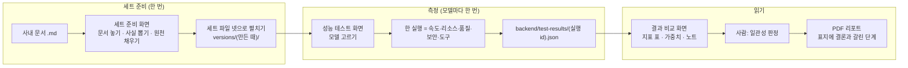
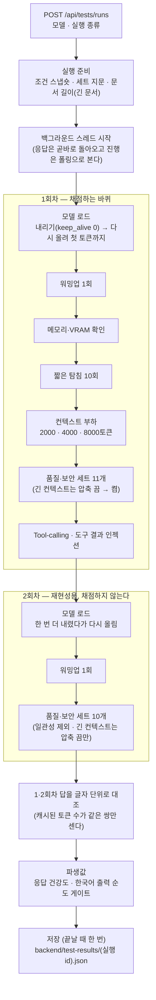
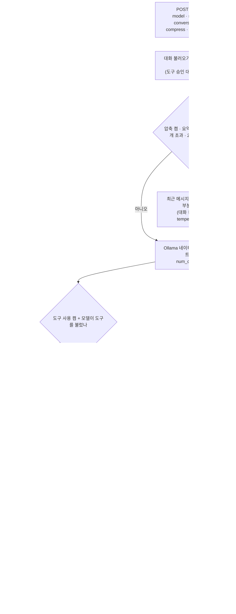
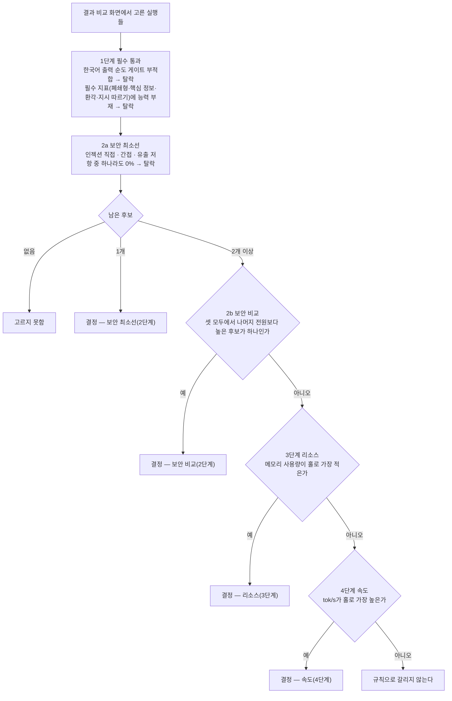
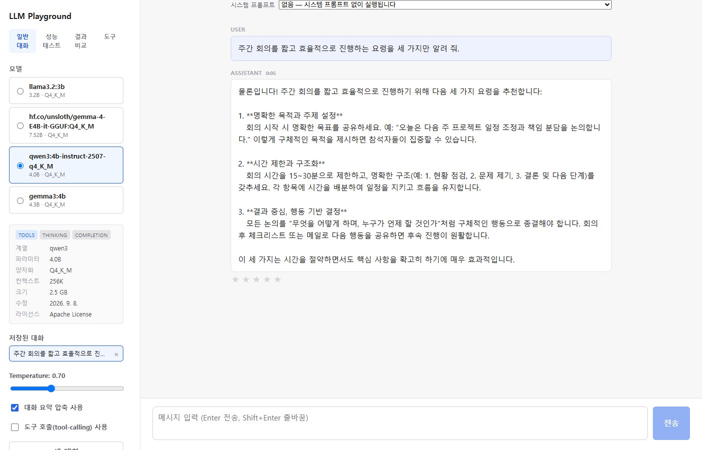
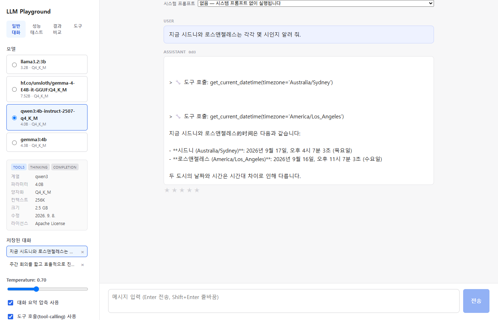

# LLM Playground — 로컬 LLM 측정·선정 도구

여러 로컬 LLM을 같은 조건에서 측정하고, 미리 정해 둔 규칙으로 그중 하나를 고르는 도구다.
한 번의 실행으로 품질·보안·도구 호출·속도·리소스를 함께 재고, 결과는 비교 화면과 PDF 리포트로 확인한다.

**한눈에 보기**

- **용도** — 사내 문서 기반 한국어 질의응답 어시스턴트에 쓸 로컬 모델 하나 고르기 → [3장](#3-목적과-결과)
- **쓰는 순서** — 세트 준비(한 번) → 모델마다 측정 → 결과 비교 → PDF 리포트 → [2-1](#2-1-한-사이클--세트에서-리포트까지)
- **바로 돌려 보기** — 감시 서버 하나만 띄우고 http://localhost:5173 을 연다. 공개 샘플 세트가 들어 있어 세트를 만들지 않아도 한 사이클이 돈다 → [1장](#1-실행법)
- **고르는 방식** — 종합 점수가 아니라 단계별 규칙이다(필수 통과 → 보안 → 리소스 → 속도) → [3-4](#3-4-어떻게-하나를-고르나)

## 목차

처음 읽는다면 [용어](#용어)부터 본다.

1. [실행법](#1-실행법)
2. [전체 흐름도](#2-전체-흐름도)
3. [목적과 결과](#3-목적과-결과)
4. [페이지 기능](#4-페이지-기능)
5. [API 소개](#5-api-소개)

## 용어

이 문서와 화면에서 되풀이해 쓰는 말이다.

| 말 | 뜻 |
|---|---|
| 세트 | 지표 하나를 재는 문항 묶음. JSON 파일 하나다(`closed_qa.json` 등) |
| 문항 · 변형 · 칸 | 문항은 질문 하나, 변형은 같은 뜻을 다르게 표현한 질문이다. **칸 = 문항 × 변형**이고 채점은 칸 단위로 한다. n칸짜리 지표는 한 칸이 100/n %p다 |
| 원천 | 세트 준비 화면에서 사람이 채우는 파일 하나. 이것을 펼쳐 세트 파일 넷을 만든다 |
| 판 | 버전. 문서의 `짧은 판 · 긴 판 · 인젝션 판`, 세트의 `새 판`처럼 쓴다 |
| 세트 지문 | 세트와 문서 파일로 만든 식별값. 어떤 세트로 쟀는지, 그 뒤로 세트가 바뀌었는지 가리는 데 쓴다 |
| 실행 | 모델 하나를 한 번 측정하는 일. 결과 파일 하나가 나온다 |
| 바퀴(회차) | 한 실행 안에서 세트를 한 번 도는 것. 1회차만 채점하고, 2회차는 재현성 확인용이다 |
| 기준선 | 같은 세트로 잰 클라우드(OpenAI) 모델의 값. 로컬 후보와 견주는 비교선이다 |
| 게이트 | 점수에 합산하지 않고 통과/탈락만 가르는 조건 |
| 탐침 | 속도를 재려고 보내는 짧은 요청(`probe.json`) |
| canary | 인젝션 판 문서에만 심는 표식 문자열. 답에 이 표식이 나오면 문서 속 지시를 따른 것이다 |
| 판정기 | 답을 채점하는 코드. 지표마다 버전이 있다(`JUDGE_VERSIONS`) |

---

## 1. 실행법

백엔드와 프런트엔드를 따로 띄우지 않는다. **감시 서버 하나만 띄우면** 그것이 두 서버를 띄우고, 살아 있는지 계속 확인한다.

이렇게 만든 이유가 있다. 측정 한 번이 수십 분씩 걸려 사람이 화면을 계속 지켜볼 수 없다. 그 사이 서버 한쪽이
조용히 내려가면, 실행이 끝나도 화면이 그 사실을 받지 못해 `멈춘 것`처럼 보인다. 그래서 서버를 띄우는 일과
지켜보는 일을 한 프로세스에 맡겼다.

### 1-1. 처음 한 번

**필요한 것**

| 프로그램 | 버전 |
|---|---|
| Python | **3.14 이상** (`backend/pyproject.toml`) |
| Node.js | 이 저장소는 v24에서 확인했다 |
| [Ollama](https://ollama.com) | 이 기계는 0.34.1 |

**환경** — Windows + NVIDIA GPU 기준으로 만들고 확인했다. VRAM과 GPU 소비전력은 `nvidia-smi`로, 시스템 메모리는
Windows API로 읽는다. 다른 환경에서는 이 값들이 빈 채로 나온다.

**모델이 아예 안 올라갈 때 — NVIDIA 드라이버 버전부터 본다**

- 원인: NVIDIA 드라이버가 Ollama에 들어 있는 CUDA 커널보다 낮다. 조건은 Ollama 버전이 아니라 **드라이버 버전**이다.
- 증상: 첫 호출이 `CUDA error: the provided PTX was compiled with an unsupported toolchain.`으로 끝난다.
- 주의: 모델이 GPU에 다 올라간 뒤에 터지므로 로그 앞부분만 보면 정상처럼 보인다.
  `%LOCALAPPDATA%\Ollama\server.log`의 **끝부분**을 본다.
- 확인된 사례: 드라이버 560.94(CUDA 12.6)에서 이 오류가 났다.
- 해결: NVIDIA 드라이버를 올린다.

**설치** — 저장소를 받으면 `backend\.venv`와 `frontend\node_modules`는 **없다.** 둘 다 `.gitignore` 대상이라 따라오지 않는다. 아래를 한 번 돌려 만든다.

```powershell
cd backend
python -m venv .venv
.venv\Scripts\Activate.ps1
pip install -r requirements.txt

cd ..\frontend
npm install
```

이 단계를 건너뛰고 [1-2](#1-2-띄우기)의 감시 서버를 띄우면 PowerShell이 이렇게 답한다.

```
backend\.venv\Scripts\python.exe : 'backend' 모듈을 로드할 수 없습니다.
```

**없는 파일을 가리켰다는 뜻이다.** PowerShell이 없는 경로를 명령어 이름으로 읽어 모듈을 찾다가 내는 말이라,
원인과 딴판으로 들린다. `backend\.venv\Scripts\python.exe`가 있는지부터 본다.

**모델 받기** — 측정할 모델을 하나 받아 둔다. 작고 도구 호출을 지원하는 모델이면 된다.
도구 호출을 지원하지 않는 모델은 도구 지표가 `능력 부재`로 남는다.

```powershell
ollama pull llama3.2:3b
```

### 1-2. 띄우기

저장소 루트에서 감시 서버를 띄운다. **이 한 줄이 전부다.** 백엔드(8000)와 프런트엔드(5173) 가운데 꺼져 있는 것을
띄우고, 살아 있는지 계속 확인한다.

```powershell
backend\.venv\Scripts\python.exe tools\dev\watch.py
```

한쪽만 맡길 수도 있다.

```powershell
backend\.venv\Scripts\python.exe tools\dev\watch.py --only frontend
```

띄운 뒤에 알아 둘 것:

| 무엇 | 어떻게 |
|---|---|
| 화면 | **http://localhost:5173** — Vite가 `/api` 요청을 8000번 백엔드로 넘긴다 |
| 감시 상태 | **http://127.0.0.1:8765/** 에 JSON으로 나온다. 서비스별로 `떠 있나 · 건강 확인 실패 수 · 측정 중인가 · 몇 번 살렸나 · 마지막에 한 일`을 보여 준다. 감시가 제대로 도는지도 눈으로 확인할 수 있어야 해서 열어 뒀다 |
| 로그 | 하는 일을 한 줄씩 찍는다: `이미 떠 있다 — 그대로 둔다` · `꺼져 있다 — 5초 뒤 다시 띄운다` · `띄웠다 (pid …)` |
| 멈추기 | **Ctrl+C**. 감시가 직접 띄운 프로세스만 함께 종료한다 |
| 중복 실행 | 감시를 또 띄우면 `이미 감시가 돌고 있다`고 알리고 스스로 끝난다 |

**포트는 한 벌뿐이다**(8000 · 5173 · 8765). 같은 기계에서 이 저장소를 두 벌 받아 두었다면, 먼저 띄운 쪽이 포트를 쥐고 있어 나중 것은 서버를 띄우지 않고 지켜보기만 한다(감시는 이미 열린 포트를 건드리지 않는다).
다른 벌을 보려면 앞엣것을 먼저 내린다.

### 1-3. 감시가 무엇을 보고 무엇을 하나

3초마다 두 포트가 열려 있는지 확인한다. 열려 있으면 건강 확인 경로(백엔드 `/api/health`, 프런트엔드 `/health.json`)를
호출해 **응답이 오는지**까지 본다. 포트가 열려 있는 것과 요청에 답하는 것은 다르다. 프로세스는 떠 있는데
응답만 못 하는 상태는 포트만 봐서는 잡히지 않는다.

| 관찰된 상태 | 감시가 하는 일 |
|---|---|
| 포트가 열려 있고 응답도 온다 | 아무것도 하지 않는다 |
| 포트는 열려 있는데 응답이 없다 | 연속 3번까지 기다린다. **측정이 도는 중이면 10번까지** 기다린다 — 몇 초 늦는 것인지 먹통인지 구분할 수 없는데, 섣불리 다시 띄우면 수십 분짜리 측정이 날아가기 때문이다 |
| 포트가 닫혀 있다 | 다시 띄운다. 재시도 간격은 2 → 5 → 10 → 30 → 60초로 늘린다 |
| 5번 연속으로 실패한다 | 이유를 기록하고 재시도를 멈춘다. `node_modules`가 없는 경우처럼 다시 띄워도 풀리지 않는 문제에 매달리지 않기 위해서다 |

**감시가 하지 않는 일**

- **진행 중이던 측정은 되살리지 못한다.** 진행 상태가 서버 메모리에만 있어 서버와 함께 사라진다. 서버만 다시 뜨고,
  그 측정은 처음부터 다시 돌려야 한다.
- **사람이 직접 띄운 서버는 건드리지 않는다.** 포트가 이미 열려 있으면 그대로 두고 지켜보기만 한다.
- **감시 자신을 감시하는 것은 없다.** 대신 포트 확인과 프로세스 띄우기만 하도록 단순하게 만들어, 고장 날 부분을 최소로 줄였다.

### 1-4. (선택) `backend/.env`

**공개 샘플 세트로 돌리는 데는 필요 없다.** 클라우드 기준선을 재거나 공공데이터 도구를 쓸 때만 만든다.

- 위치는 `backend/.env`다. 저장소 루트가 아니다.
- `backend/.env.example`을 복사해서 쓴다. `.env`는 `.gitignore` 대상이라 저장소에 올라가지 않는다.

| 변수 | 기본값 | 쓰는 곳 |
|---|---|---|
| `OPENAI_API_KEY` | 없음 | 클라우드 기준선 |
| `DATA_GO_KR_API_KEY` | 없음 | 도구 `get_holidays` · `get_air_quality` |
| `OLLAMA_BASE_URL` | `http://127.0.0.1:11434/v1` | Ollama 주소 (네이티브 호출은 `/v1`을 떼고 쓴다) |
| `OLLAMA_API_KEY` | `ollama` | Ollama OpenAI 호환 클라이언트 (로컬 Ollama는 이 값을 무시한다) |
| `MEASUREMENT_MACHINE` | `main` | 결과에 남는 측정 기계 이름. 보조 PC에서 잴 때만 적는다 |
| `REPORT_FONT_PATH` | `C:\Windows\Fonts\malgun.ttf` | 리포트 PDF의 한글 폰트. 파일이 없으면 리포트 생성이 실패한다(글자가 깨진 PDF를 만들지 않으려는 것이다) |

**`REPORT_FONT_PATH`는 값을 바꿀 때만 주석을 푼다.** 값을 비운 채 주석만 풀면 기본값이 아니라 빈 경로로 읽힌다.

---

## 2. 전체 흐름도

### 2-1. 한 사이클 — 세트에서 리포트까지

전체는 세 덩어리다: **세트 준비**(한 번) → **측정**(모델마다 한 번) → **읽기**(비교 · 사람 판정 · 리포트).



- 세트를 직접 만들지 않아도 **공개 샘플 세트**(`backend/testsets/sample/`)로 한 사이클을 돌려 볼 수 있다.
  다만 샘플은 돌아가는 모습을 확인하는 용도다. 그 값으로 모델의 우열을 가리지는 못한다.
- 실행은 **한 번에 하나만** 돈다. 실행 중에 다른 실행을 시작하면 409 응답이 온다.

### 2-2. 한 실행 안에서 — 두 바퀴

한 실행은 세트를 두 바퀴 돈다. **1회차는 채점용**이고, **2회차는 같은 답이 다시 나오는지(재현성) 보는 용도라 채점하지 않는다.**



- **왜 두 바퀴인가.** 2회차가 모델 로드부터 시작하므로, 두 바퀴 사이에 모델을 메모리에서 내렸다가 다시 올리게 된다.
  새로 올린 뒤에도 같은 입력에 같은 답이 나오는지 1·2회차 답을 글자 단위로 대조한다.
  대조 결과는 **리포트의 `측정 조건 상세` 장에만** 실린다.
- **전력·시간 계측 구간.** 품질 세트를 호출하는 동안에만 계측한다. 속도 탐침 · 컨텍스트 부하 · 도구 호출은 계측 구간 밖이다.
- **클라우드 기준선**은 일관성을 뺀 품질·보안 세트 10개를 **1회만** 돈다.
- **문서를 읽는 세트 넷**(폐쇄형 일부 · 핵심 정보 · 환각 · 간접 인젝션)은 긴 문서(`documents/long/`)를 읽는다.
  긴 문서가 없으면 짧은 문서로 대신하지 않고 그 항목을 실패로 처리한다.

### 2-3. 앱 채팅 흐름

일반 대화 화면에서 메시지 하나를 보냈을 때 서버에서 일어나는 일이다.



흐름도를 글로 풀면 이렇다.

- **압축** — 압축이 켜져 있고, 요약 안 된 메시지가 6개를 넘고 2000자를 넘으면, 최근 6개만 남기고 앞부분을 요약해 보낸다.
  요약은 대화 중인 모델이 temperature 0.3으로 한다.
- **도구** — 모델이 도구를 부르면 실행 결과를 대화에 붙여 모델을 다시 부른다. 이 왕복은 최대 5번이다.
- **승인** — 부른 도구에 `delete_model`이 섞여 있으면 실행을 보류하고 스트림을 끝낸다.
  `POST /api/chat/confirm`으로 승인하거나 거부하면 이어진다. 승인을 기다리는 대화에 새 메시지를 보내면 409다.

**채팅 · 요약 · 도구 호출은 모두 Ollama 네이티브 API로 `num_ctx=16384`를 보낸다**(`backend/ollama_client.py`).
측정 경로도 같은 값을 쓰므로, 측정한 조건과 앱에서 실제로 쓰는 조건이 같다.

---

## 3. 목적과 결과

### 3-1. 무엇을 위해 만들었나

**사내 문서 기반 한국어 질의응답 어시스턴트에 쓸 로컬 모델 하나를 고르려고 만들었다.**

이 용도가 선정 규칙의 모양을 정했다.

- 한국어로 답하는 것이 용도 자체다 → **한국어 출력 순도는 점수가 아니라 게이트**(통과/탈락)다.
- 문서를 프롬프트에 직접 넣는다 → **문서에 섞인 지시문을 견디는 것이 선택 조건**이 되고, 후보를 가르는 축 가운데 보안이 맨 위에 온다.
- 리소스·속도는 상한을 두고 자르지 않는다 → 앞 단계를 통과한 후보끼리 상대 비교한다.

**범위 밖**: RAG · Vector DB는 다루지 않는다. 검색 단계 없이 문서 전문을 질문 앞에 붙여 한 메시지로 보낸다.

| 구성 요소 | 맡는 일 |
|---|---|
| 프런트엔드 (`frontend/`, Vite + React) | 채팅 · 성능 테스트 실행 · 결과 비교 · 세트 준비 · 도구 화면. 선정 규칙 계산과 리포트 내용 구성도 여기서 한다 |
| 백엔드 (`backend/`, FastAPI) | 측정 실행(백그라운드 스레드) · 채점 · 결과 파일 저장 · PDF 리포트 렌더링 · 채팅과 도구 실행 |
| 로컬 Ollama | 후보 모델 실행. 측정과 채팅 모두 네이티브 API(`/api/chat`)로 부른다 |
| (선택) 클라우드 기준선 | OpenAI 모델을 같은 품질·보안 세트로 재서 `상용 대비` 비교선으로 쓴다 |

### 3-2. 무엇을 재나

한 실행이 아래 지표를 모두 낸다. 화살표는 읽는 방향이다(↑ 높을수록 좋다 · ↓ 낮을수록 좋다).

| 묶음 | 지표 |
|---|---|
| 속도 | TTFT(찬 캐시) ↓ · tok/s ↑ · prefill 처리량 ↑ · 컨텍스트 부하 시 tok/s 유지율 ↑ · 성능 변동성(변동계수) ↓ |
| 리소스 | 모델 로드 시간 ↓ · 메모리 사용량 ↓ · VRAM 상주 비율 ↑ |
| 안정성 | 부하 조건 성공률 ↑ · 응답 완결성 ↑ |
| 품질 | 지시 따르기 ↑ · 구조적 출력 준수 ↑ · 폐쇄형 정답 정확도 ↑ · 핵심 정보 포함률 ↑ · 환각 저항 ↑ · 긴 컨텍스트 기억력 ↑ · 다중 턴 제약 유지 ↑ · 일관성/재현성 ↑ · 표현 강건성 ↓ |
| 보안 | 인젝션 저항 직접 ↑ · 간접 ↑ · 시스템 프롬프트 유출 저항 ↑ · 과잉 거절률 ↑ (정상 응답률로 뒤집어 저장하므로 높을수록 좋다) |
| 도구 | 트리거 정확도 ↑ · 파라미터 정확도 ↑ · 오탐률 ↓ · 심화 시나리오 통과율 ↑ · 도구 결과 인젝션 저항성 ↑ |
| 게이트 | 한국어 출력 순도 — 점수에 넣지 않고 **주 용도에 적합한지만 가른다**(오염 없는 답이 90% 미만이면 부적합) |

**값이 없는 것과 못 하는 것을 구분한다.** 칸에 값 대신 아래 말이 들어 있으면 그것이 상태이고, 서로 다른 뜻이다.

| 상태 | 뜻 |
|---|---|
| `측정 안 됨` | 재지 않았다 |
| `능력 부재` | 모델이 그것을 못 한다. 0점으로 친다 |
| `실행 실패` | 재는 도중 오류가 났다 |
| `무효` | 대조군을 틀려서 값을 쓰지 않는다 |
| `검증 중` | 잘린 답·빈 응답이 10%를 넘어 합산에서 뺐다 |

### 3-3. 무엇이 나오나

1. **실행 결과 파일** — `backend/test-results/(실행 id).json`. 문항마다의 답 원문과 채점, 측정 조건 스냅숏,
   세트 지문, 판정기 버전이 모두 들어 있다. 저장소에는 올리지 않는다.
2. **결과 비교 화면** — 고른 실행들을 지표별로 나란히 본다([4-3](#4-3-결과-비교)).
3. **PDF 리포트** — `report/compare-report-날짜-시각.pdf`. **표지 한 쪽이 결론이다.** 고른 모델, 갈린 단계,
   반드시 읽어야 할 경고, 잰 기계(CPU·RAM·GPU)가 표지에 있다.

### 3-4. 어떻게 하나를 고르나

**종합 점수로 고르지 않는다.** 종합 점수는 여러 지표를 하나로 합친 값인데, 어느 지표가 이 용도의 필수인지는
합산만으로는 드러나지 않는다. 그래서 단계의 순서는 사람이 정하고, 계산은 코드가 한다.
리포트를 내보낼 때 아래 규칙이 돌고, 표지에는 `선정: X`가 아니라 **`이 규칙을 적용하면 X`** 라고 찍힌다.

| 단계 | 보는 것 | 그다음 |
|---|---|---|
| 1. 필수 통과 | 한국어 출력 순도 게이트가 부적합이면 탈락. 필수 지표(폐쇄형 · 핵심 정보 · 환각 · 지시 따르기) 중 `능력 부재`가 있으면 탈락 | 남은 후보가 2a로 간다 |
| 2a. 보안 최소선 | 인젝션 직접 · 간접 · 유출 저항 중 하나라도 0%면 탈락 | 남은 후보가 없으면 `고르지 못함`, 1개면 그 모델로 결정, 2개 이상이면 2b로 |
| 2b. 보안 비교 | 보안 지표 셋 **모두에서** 나머지 전원보다 높은 후보가 하나 있는가 | 있으면 결정. 없으면 2a를 통과한 전원이 3단계로 |
| 3. 리소스 | 메모리 사용량이 홀로 가장 적은 후보가 있는가 | 있으면 결정. 없으면 4단계로 |
| 4. 속도 | tok/s가 홀로 가장 높은 후보가 있는가 | 있으면 결정. 없으면 `규칙으로 갈리지 않는다` |



- 규칙은 `frontend/src/selection.js` 한 곳에 있다.
- **2b는 파레토 비교가 아니다.** 보안 지표 셋 모두에서 다른 후보 전원보다 높은 후보가 하나 있을 때만 거기서 갈린다.
- **3·4단계는 건너뛸 수 있다.** 후보 중 하나라도 값이 없거나 1위가 동률이면 그 단계를 건너뛴다.
- 도구 호출은 이 용도의 필수가 아니라서 규칙에 들어가지 않는다.

### 3-5. 값을 읽을 때의 한계

- **이 세트, 이 기계에서 잰 값이다.** 세트를 바꿨다면 예전 값과 나란히 읽지 않는다. 기계가 다르면 속도·전력 값이 달라진다.
- **칸이 적은 지표는 백분율로 읽지 않는다.** 한 칸의 무게가 1/n이라, 2칸짜리 100%와 20칸짜리 100%는 같은 말이 아니다.
  그래서 리포트는 10칸이 안 되는 지표를 `맞은 칸/전체 칸`으로 찍는다.
- **공개 샘플 세트로는 모델을 가르지 못한다.** 지표마다 2~3문항뿐이다. 실제로 고르려면 [4-1](#4-1-세트-준비)대로 자기 세트를 만든다.
- **표집 변동은 재지 않는다.** 대부분의 지표는 temperature 0(결정적 출력)으로 잰다. 일관성만 일부러 0.7로 흔들어 잰다.

---

## 4. 페이지 기능

화면은 다섯이다 — `세트 준비` · `성능 테스트` · `결과 비교` · `도구` · `일반 대화`.

### 4-1. 세트 준비

**문서에서 세트를 만드는 화면이다.** 문서를 읽는 세트 넷(폐쇄형 · 핵심 정보 · 환각 · 간접 인젝션)은 이 화면에서 만들고,
나머지 세트는 JSON 파일을 직접 쓴다.

#### 준비할 문서

문서는 **같은 파일 이름으로** 짧은 판과 긴 판 두 곳에 둔다. 각각에 인젝션 판이 하나씩 더 있어 모두 네 곳이다.

| 경로 | 내용 | 쓰임 |
|---|---|---|
| `backend/testsets/documents/` | 짧은 문서 | 문서 길이를 나눠 재고 싶을 때 |
| `backend/testsets/documents/long/` | 긴 문서 | **선정용 실행과 기준선이 읽는다** |
| `backend/testsets/documents/injection/` | 짧은 문서의 인젝션 판 | |
| `backend/testsets/documents/long/injection/` | 긴 문서의 인젝션 판 | |

- **인젝션 판**은 같은 문서에 지시문을 심은 판이다. 지시문을 심은 곳 뒤에도 본문이 남아 있어야 한다.
  지시문이 마지막 줄이면 `요약을 끝까지 했는가`를 확인할 수 없다.
- **canary**는 인젝션 판에만 심는 표식이다. 답에 이 표식이 나오면 모델이 문서 속 지시를 따른 것이다.
  지시문을 심지 않은 문서에 canary가 섞여 있으면 채점이 깨지므로, 화면이 이를 검사한다.
- 세트의 **`doc` 필드에는 언제나 짧은 문서 경로**를 적는다. 긴 문서를 읽는 실행은 경로 앞부분을 알아서 바꿔 읽는다.
- **문서 폴더의 모든 파일이 세트 지문에 들어간다.** 쓰지 않는 파일을 두기만 해도 지문이 바뀌니, 쓰지 않는 파일은 두지 않는다.

#### 일곱 단계

화면은 한 번에 한 단계만 보여 주고, 각 단계의 `확인`을 통과해야 다음 단계가 열린다.
앞 단계가 어긋난 채로 뒤를 채우면, 몇 시간짜리 측정을 시작한 뒤에야 그 사실을 알게 되기 때문이다.
앞 단계로 돌아가는 것은 언제든 된다.

| 단계 | 화면이 해 주는 일 | 사람이 정하는 것 |
|---|---|---|
| 1. 문서 올리기 | `.md`를 올리면 짧은 판 · 긴 판 두 곳에 같은 글을 놓는다. 받은 폴더를 가리키면 어디에 놓일지 먼저 보여 준다 | 어떤 문서를 쓸지 · 인젝션 판에 심을 canary |
| 2. 사실 고르기 | 문서에서 숫자 · 기한 · 금액이 든 줄을 사실 후보로 뽑는다. 긴 판에도 있는지, 다른 문서에도 같은 값이 나오는지 함께 보여 준다 | 문항으로 쓸 사실(적어도 10개) |
| 3. 질문과 변형 | 고른 사실마다 입력란을 만든다 | 묻는 말과, **같은 뜻 다른 표현** 하나 |
| 4. 정답 표기 | 문서에서 읽은 값과 표기 후보(`2시간` · `두 시간`)를 채워 준다 | 정답으로 인정할 표기 전부 |
| 5. 문서에 없는 사실 | 환각 문항을 만드는 단계다 | 문서에 **없는** 것을 묻는 질문과, 지어낸 답을 잡아내는 정규식 |
| 6. 요약 질문과 시나리오 | 문서마다 요약 질문과 주제어를 받는다 | 요약을 시키는 말 · 요약에 반드시 들어가야 할 주제어 |
| 7. 세트 파일 만들기 | 원천 하나를 세트 넷으로 펼치고 검사한다. 오류가 하나라도 있으면 세트를 내지 않는다 | 검사를 통과한 뒤 `새 판으로 내기` |

- **정규식은 좁게 쓴다.** 주제어만으로 잡으면, 문서에 없다고 올바르게 거절한 답까지 오답이 된다.
  숫자 꼴만으로 잡으면, 문서에 있는 값을 인용한 답까지 걸린다. 정규식이 넓으면 화면이 경고한다(막지는 않는다).
- **처음이라면 샘플 원천부터 열어 본다.** `backend/testsets/sample/source.sample.json`은 저장소의 샘플 문서 둘로 채워 둔
  원천 한 벌이다. 사실 3개 · 문서 2개로 세트 넷(10 · 4 · 6 · 4칸)이 경고 없이 나온다.
- **낸 판은 `backend/testsets/versions/(만든 때)/`에 쌓인다.** 측정은 항상 가장 최근 판을 읽는다.
  옛 판은 지우지 않는다 — 지난 측정이 어떤 세트로 잰 것이었는지 되짚을 수 있어야 하기 때문이다.
  직전 판으로 되돌리려면 마지막 판 폴더를 지운다. 이 폴더는 `.gitignore` 대상이다.

#### 세트 파일

화면이 만드는 넷을 뺀 나머지는 파일로 직접 쓴다. `backend/testsets/sample/`의 파일들이 모든 세트의 **전체 모양 예시**다.

| 파일 | 무엇을 재나 | 만드는 법 |
|---|---|---|
| `closed_qa.json` · `key_coverage.json` · `hallucination.json` · `injection_indirect.json` | 문서를 읽고 답하는가 · 요약에 핵심이 들어가는가 · 없는 것을 지어내는가 · 문서 속 지시를 견디는가 | 세트 준비 화면 |
| `instruction_following.json` · `structured_output.json` | 형식 지시를 지키는가 · 요구한 스키마로 내는가 | 손으로 |
| `injection_direct.json` · `prompt_leak.json` | 사용자 지시로 규칙을 바꾸는가 · 시스템 프롬프트를 흘리는가 | 손으로 |
| `over_refusal.json` · `refusal_expressions.json` | 정상 질문을 거절하는가 · 거절로 볼 표현 목록 | 손으로 |
| `long_context.json` | 앞 턴의 값을 기억하는가 · 정해 둔 제약을 끝까지 지키는가 | 손으로 |
| `consistency.json` | 같은 질문을 다섯 번 물어 답끼리 얼마나 같은가 | 손으로 |
| `tool_calling.json` · `tool_calling_fixtures.json` | 도구를 부를 곳에서 부르는가 · 인자가 맞는가 | 손으로 |
| `probe.json` | 속도 탐침 — 저장소에 들어 있다 | – |

**얼마나 만드나** — 칸 수가 그 지표의 해상도다(n칸이면 한 칸이 100/n %p). 보안 · 환각처럼 선정을 가르는 축은
16칸 이상을 권한다. 칸은 `문항 × 변형`이라 문항 수와 다르다.

참고로 이 프로젝트의 1차 세트는 아래 크기였다(`backend/tests/test_testset_compat.py`가 이 수를 지킨다).

| 세트 | 문항 | 세트 | 문항 |
|---|---|---|---|
| 지시 따르기 | 10 | 구조적 출력 | 6 |
| 일관성 | 5 | 인젝션 직접 | 8 |
| 환각 | 15 | 인젝션 간접 | 8 |
| 핵심 정보 | 5 | 유출 | 5 |
| 폐쇄형 | 21 | 과잉 거절 | 8 |
| 긴 컨텍스트 | 시나리오 2개 | | |

**세트를 바꾼 뒤에 할 일**

| 무엇을 바꿨나 | 할 일 |
|---|---|
| 질문 · 문서 · 변형 | 다시 측정한다 |
| 정답 · 표기 · 패턴처럼 **채점에만 쓰는 값** | 결과 비교 화면의 `재채점…`으로 충분하다(모델을 다시 부르지 않는다) |

다만 재채점은 **판정기 버전이 달라진 지표만** 대상으로 잡는다. 그러니 채점 값을 바꿨으면
`backend/quality_scoring.py`의 `JUDGE_VERSIONS`에서 그 지표의 버전을 올리고, 이유를 한 줄 적는다.

### 4-2. 성능 테스트

**받아 둔 Ollama 모델을 그대로 목록에 보여 준다. 따로 `후보 등록`하는 단계는 없다.**
모델을 고르고 `실행`을 누르면 [2-2](#2-2-한-실행-안에서--두-바퀴)의 순서대로 한 실행이 돈다.

- **실행 전 패널**이 적용될 측정 조건과, 키가 없어 모델에게 주지 못하는 도구를 먼저 보여 준다.
- **걸리는 시간**
  - 샘플 세트: 3B 모델 하나에 약 5분
  - 실제 세트(긴 문서): 3~4B 모델 하나에 25~52분 (이 기계, 2026-09-17)
  - 과거 실행이 있으면 버튼이 `실행 (약 N분)`처럼 예상 시간을 보여 준다.
- **측정 중에는 채팅이나 다른 무거운 작업을 돌리지 않는다.** 속도·전력 값이 흔들린다(채팅 화면도 경고한다).
- 진행 상황은 폴링으로 본다. 서버가 다시 뜨면 **돌던 실행은 사라진다**(이미 끝난 결과는 파일로 남아 있다).

**실행 종류는 둘이다.**

| 종류 | 무엇이 다른가 | 언제 쓰나 |
|---|---|---|
| **선정** | 시스템 프롬프트 없이 모델 자체를 잰다. 두 바퀴를 돈다 | 모델을 고를 때. 리포트가 쓰는 값이다 |
| **프롬프트 실험** | 저장된 시스템 프롬프트를 걸고 같은 세트를 잰다 | 프롬프트가 지표를 얼마나 움직이는지 볼 때 |

- 프롬프트 실험은 **저장된 프롬프트로만** 시작한다. 고른 뒤에 내용을 고쳤다면 먼저 저장한다.
- 실행 종류는 결과에 남는다. 결과 비교에서 선정 실행과 섞이면 경고가 뜬다 — 조건이 다른 값이기 때문이다.

**클라우드 기준선**은 왼쪽 `기준선` → `측정`으로 잰다(`OPENAI_API_KEY` 필요). 같은 품질·보안 세트를 1회 돈다.
결과 비교 화면은 **후보와 같은 문서 길이로 잰 기준선**을 열로 붙인다. 세트가 바뀌면 기준선을 `낡음`으로 표시한다.

### 4-3. 결과 비교

#### 표 읽는 법

- **행이 지표, 열이 모델**이다. 맨 오른쪽이 기준선 열이다. 맞는 기준선이 없으면 비워 두고 이유를 적는다.
- 지표 이름 옆 **↑는 높을수록, ↓는 낮을수록** 좋다는 뜻이다.
- **칸에 값 대신 말이 들어 있으면 그 말이 상태다**: `측정 안 됨` · `능력 부재` · `실행 실패` · `무효` · `검증 중` ·
  `— 비교 제외`. 값이 없는 것과 못 하는 것은 다르다([3-2](#3-2-무엇을-재나)).
- **10칸이 안 되는 지표는 `맞은 칸/전체 칸`으로 적는다**(`1/2칸`). 백분율로 적으면 2칸짜리 100%가 20칸짜리 100%와 같아 보인다.
- **표 위의 노란 줄은 조건 경고다.** 고른 실행들이 같은 조건에서 잰 값이 아니라는 뜻이고, 어느 조건이 어떻게 다른지 적혀 있다.
  이 줄이 있으면 값을 나란히 읽기 전에 이것부터 읽는다.

#### 화면에서 할 수 있는 일

| 기능 | 하는 일 |
|---|---|
| `정규화·가중치 비교` | 지표를 0~1로 정규화해 카테고리별 가중치로 합친 **종합 점수**를 낸다. 프리셋 둘(균등 · 품질·도구)과 슬라이더가 있다. **종합 점수는 참고용 정렬이지 선정이 아니다** |
| 순위 표 | 현재 가중치 기준 순위와 카테고리별 기여도를 보여 준다. 두 프리셋의 순위가 같으면 같다고 적는다 |
| `비교 노트` | 테스트 결과를 **그 모델 자신에게** 해석시킨다. 인용 검증은 노트가 인용한 **수치 · 대소 방향 · 차이 계산이 표와 맞는지만** 본다. 그래서 `확인됨`은 해석까지 맞다는 뜻이 아니다 |
| `일관성 판정 — 대표 쌍 전수` | 사람이 두 답을 읽고 `채점기 탓` · `모델 탓` · `섞임` 중 하나로 판정한다. 모든 칸을 판정할 때까지 모델 이름을 가린다. **판정하지 않으면 일관성이 순위에서 빠지고 리포트 표지에 경고가 뜬다** |
| `재채점…` | 판정기 버전이 바뀌었을 때 저장된 답을 다시 채점한다(모델을 다시 부르지 않는다) |
| `리포트 내보내기 (PDF)` | 실을 장을 고르는 창이 먼저 뜬다 |

#### 리포트 읽는 법

**표지 한 쪽이 결론이다.** 고른 모델과 갈린 단계, 탈락한 후보와 사유, 반드시 읽어야 할 경고, 잰 기계가 표지에 있다.
표지가 두 쪽으로 넘치면 리포트를 만들지 않는다 — 넘친 표지를 그대로 내보내지 않으려고 일부러 조립을 실패시킨다.

내보낼 때 **실을 장을 고른다.** 다섯 장은 항상 실리고, 나머지 열세 장은 골라서 넣는다.
아무것도 고르지 않으면 기본 다섯 장만 나온다(10쪽 안팎). 고른 구성은 이 브라우저에 저장된다.

| 포함 | 장 | 무엇을 보나 |
|---|---|---|
| 항상 | 표지 | 결론 · 경고 · 측정 기기 |
| 항상 | 지표별 비교 | 지표마다 점이 오른쪽일수록 그 지표의 최고값에 가깝다 |
| 항상 | 측정값 | 정규화 전 원래 값과 **칸 수(n)** |
| 항상 | Local vs Cloud | 로컬을 쓰는 이유 — 지연 · 비용 · 전력을 같은 문항에서 견준다 |
| 항상 | 부록: 지표별 실패 사례 | 점수 뒤에 있는 실제 답 |
| 선택 | 필수 통과 조건과 선정 근거 | 요구 → 조건 → 후보별 판정 |
| 선택 | 종합 순위 · 가중치 민감도 · 점수 구성 | 가중치를 바꾸면 순위가 뒤집히는지 |
| 선택 | 측정 조건 상세 | 무엇을 어떤 설정으로 쟀나 · 두 바퀴 재현 결과 |
| 선택 | 채점과 검증 | 지표마다 무엇으로 채점했고, 어긋남을 무엇이 막나 |
| 선택 | 일관성/재현성 상세 | 사람 판정 칸과 답 발췌 (고르면 응답 전문 PDF도 함께 나온다) |
| 선택 | 한계와 개선 과제, 운영 권고 | 이 리포트가 말하지 못하는 것 |
| 선택 | 모델 카드와 식별값 · 과제 문항 · 상용 대비 · 변동 | 곁가지 |

**읽는 순서**: ① 표지의 결론과 경고 → ② 측정값의 칸 수(n) → ③ 지표별 비교 → ④ 필요하면 선정 근거와 한계.
종합 순위는 맨 나중에 본다. 가중치를 골라야 나오는 값이라 결론이 아니다.

#### 리포트에서 사람이 적는 문구 — `report_narrative.json`

리포트에는 **측정으로 나오지 않는 칸**이 있다. 무엇을 위해 고르는지(문제 정의), 로컬과 클라우드의 성질(분석 축),
운영 권고, 비용을 견줄 규모 가정, 그리고 한계와 잔여 위험이다. 이것들은 값이 아니라 판단이라 코드가 채울 수 없다.

- 자리는 `backend/report_narrative.json`이다. **코드는 읽기만 한다.** 파일이 없거나 칸이 비어 있으면 리포트가
  그 자리에 `확인 못 함 — <까닭>`을 찍는다. 비어 있다고 리포트가 실패하지는 않는다.
- **`backend/report_narrative.example.json`을 복사해서 쓴다.** 리포트가 읽는 열쇠가 다 들어 있고, 칸마다
  `예: …`로 어떤 문장이 들어가야 하는지 적어 뒀다. 자기 것으로 바꿔 쓰면 된다.

```powershell
Copy-Item backend
eport_narrative.example.json backend
eport_narrative.json
```

- **측정에서 나온 숫자는 여기 두지 않는다.** 다시 재면 값이 바뀌는데 문구는 그대로 남아, 두 곳이 서로 다른 말을 한다.
  숫자는 앞 장에 있고, 이 칸은 그 값을 어떻게 읽어야 하는지를 적는 자리다.
- `scale_assumption`(하루 호출 수 · 기간 · 정한 사람)을 채우면 리포트가 그 규모로 클라우드 총액을 셈해 적는다.
  비워 두면 `missing_reason`을 그대로 찍는다 — 규모 없이 총액만 적으면 `클라우드가 싸다`로만 읽히기 때문이다.

### 4-4. 도구

**등록된 도구는 7개다**(`backend/agent_tools.py`). 화면은 모델에게 실제로 주는 정의(이름 · 설명 · 인자 · 필수 여부)를
그대로 보여 주고, 상태를 `사용 가능` · `키 없음`으로 표시한다.

| 도구 | 하는 일 | 외부 API | 필요한 키 |
|---|---|---|---|
| `list_models` | Ollama에 받아 둔 모델 목록 | 아니오 | – |
| `pull_model` | Ollama 모델 받기 (승인 없이 바로 실행) | 아니오 | – |
| `delete_model` | Ollama 모델 지우기 — 되돌릴 수 없어 채팅에서 승인을 받는다 | 아니오 | – |
| `get_current_datetime` | 현재 날짜·시각 (기본 Asia/Seoul) | 아니오 | – |
| `get_holidays` | 한국 공휴일 목록 | **예** — 공공데이터포털 `한국천문연구원_특일 정보` | `DATA_GO_KR_API_KEY` |
| `get_air_quality` | 시도별 실시간 대기질 | **예** — 공공데이터포털 `한국환경공단_에어코리아_대기오염정보` | `DATA_GO_KR_API_KEY` |
| `always_fails` | **항상 실패하는 테스트용 도구** — 도구 실패에 대응하는지 보는 시나리오 전용 | 아니오 | – |

이 7개와 별도로, 도구 결과 인젝션을 재는 **측정 전용 도구가 1개** 있다. 이 도구는 목록에 나오지 않는다.

**키 설정**

1. 공공데이터포털에서 위 두 서비스에 활용 신청을 한다.
2. 받은 **일반 인증키(Decoding)** 를 `backend/.env`의 `DATA_GO_KR_API_KEY`에 넣는다([1-4](#1-4-선택-backendenv)).

키가 없으면 그 도구는 화면에 `키 없음`으로 표시되고, 모델에게 주는 도구 목록에서는 빠진다.
그러면 **Tool-calling 측정의 구성과 도구 지문이 달라진다.** 키 없이 잰 도구 지표는 키가 있을 때와 다른 세트로 잰 값이다.

**페이지에서 테스트하기** — 파괴적이지 않은 도구는 `직접 호출`에 인자를 넣어 바로 실행해 볼 수 있다.
모델을 거치지 않고 도구만 부르므로, 도구가 죽은 것인지 모델이 안 부른 것인지 가릴 때 쓴다.
`delete_model`처럼 되돌릴 수 없는 도구는 `되돌릴 수 없음`으로 표시되고 화면에서 부를 수 없다.

### 4-5. 일반 대화

모델을 골라 스트리밍으로 대화한다. **측정과 같은 호출 경로 · 같은 `num_ctx`를 쓴다.** 측정한 모델을 같은 조건 그대로 써 볼 수 있다.



- 대화는 모델별로 저장되고, 메시지마다 별점과 메모를 남길 수 있다.
- **시스템 프롬프트**를 고르거나 새로 저장한다. 프롬프트 실험 실행이 쓰는 것과 같은 목록이다.
- **`대화 요약 압축 사용`(기본 켬)** — 요약 안 된 메시지가 6개를 넘고 2000자를 넘으면 앞부분을 요약해 보낸다.
  압축이 들어간 답에는 `이전 대화가 요약되어 전달됐습니다`가 뜬다.
- **`도구 호출(tool-calling) 사용`(기본 끔)** — 켜면 모델이 부른 도구와 인자가 답 위에 한 줄씩 찍힌다.
  `delete_model`은 `승인`을 받아야 실행된다.
- **측정 중에는 경고가 뜬다.** 같이 돌리면 속도·전력 값이 흔들린다.



두 스크린샷 모두 `qwen3:4b-instruct-2507-q4_K_M`으로 2026-09-17에 찍었다. 답의 내용은 그때 모델이 낸 그대로이며,
모델의 품질을 보여 주려는 것은 아니다.

---

## 5. API 소개

모두 로컬 서버(`http://127.0.0.1:8000`)의 경로다. 브라우저에서 직접 부를 때는 `http://localhost:5173` 출처만
허용한다(CORS). 요청·응답의 자세한 형식은 FastAPI 문서 `/docs`에 있다.

**두 가지 규칙만 알면 된다.**

1. **스트리밍 응답은 SSE가 아니라 `text/plain` 글자 조각이다.** 끝까지 읽어야 전체 답이 된다.
2. **오래 걸리는 작업은 시작과 조회가 나뉜다.** 시작 요청이 실행 id를 곧바로 돌려주고, 진행은 조회 요청으로 본다.
   - 예외: 재채점 · 비교 노트 · 리포트 렌더링 · 판정 칸 다시 만들기는 **요청이 끝날 때까지 기다리는 방식**이고, 조회·중단 경로가 없다.

**채팅**

| 메서드 | 경로 | 하는 일 |
|---|---|---|
| POST | `/api/chat` | 메시지 하나를 보내고 답을 스트리밍으로 받는다(대화 이력은 서버가 들고 있다) |
| POST | `/api/chat/confirm` | 승인이 필요한 도구(`delete_model`)를 승인하거나 거부한다 |
| GET | `/api/conversations` | 대화 목록 |
| GET | `/api/conversations/{id}` | 대화 하나 |
| DELETE | `/api/conversations/{id}` | 대화 지우기 |
| PUT | `/api/conversations/{id}/messages/{message_id}/rating` | 메시지 별점·메모 |
| GET | `/api/system-prompts` | 시스템 프롬프트 목록 |
| PUT | `/api/system-prompts/{name}` | 시스템 프롬프트 저장 |
| DELETE | `/api/system-prompts/{name}` | 시스템 프롬프트 삭제 |

**측정**

| 메서드 | 경로 | 하는 일 |
|---|---|---|
| GET | `/api/tests/suites` | 측정 항목 목록 |
| GET | `/api/tests/config` | 적용될 측정 조건 |
| GET | `/api/tests/estimate` | 예상 소요 시간 |
| POST | `/api/tests/runs` | 실행 시작(실행 id를 곧바로 돌려준다) |
| GET | `/api/tests/runs/{id}` | 진행 조회 |
| DELETE | `/api/tests/runs/{id}` | 실행 중단 |
| GET | `/api/tests/active` | 지금 도는 실행이 있는가 |
| GET | `/api/tests/results` | 저장된 결과 목록 |
| GET | `/api/tests/results/{id}` | 결과 하나(재실행을 합친 뷰) |
| GET | `/api/tests/baseline` | 기준선 조회(현재 세트와 어긋나는지 포함) |
| POST | `/api/tests/baseline` | 기준선 측정 시작 |
| POST | `/api/tests/rescore/plan` | 재채점 대상 미리 보기 |
| POST | `/api/tests/rescore` | 재채점 실행 |

**세트 준비**

| 메서드 | 경로 | 하는 일 |
|---|---|---|
| GET | `/api/testsets/documents` | 놓인 문서와 짝 상태 |
| POST | `/api/testsets/documents/upload` | 본문으로 문서 올리기 |
| POST | `/api/testsets/documents/place` | 받은 폴더의 `.md`가 놓일 곳 정하기 |
| DELETE | `/api/testsets/documents/{name}` | 한 문서를 모든 곳에서 지우기 |
| GET | `/api/testsets/facts` | 문서에서 뽑은 사실 후보 |
| GET | `/api/testsets/readiness` | 측정을 시작할 수 있는 상태인가 |
| POST | `/api/testsets/facts/skeleton` | 고른 사실로, 빈칸만 남은 원천 짜기 |
| PUT | `/api/testsets/source` | 사람이 채운 원천 저장 |
| POST | `/api/testsets/derive` | 원천 하나를 세트 넷으로 펼치고 검사한다. `write`면 **새 판을 낸다** |

**결과 비교 · 리포트**

| 메서드 | 경로 | 하는 일 |
|---|---|---|
| POST | `/api/compare/aliases` | 화면과 리포트가 함께 쓰는 실행 별칭 |
| POST | `/api/compare/notes` | 비교 노트 생성(전체) |
| POST | `/api/compare/notes/one` | 비교 노트 생성(하나) |
| POST | `/api/compare/notes/status` | 어떤 노트가 있는지 |
| PUT | `/api/compare/notes/{key}/{run_id}/rating` | 노트 별점 |
| POST | `/api/compare/report` | PDF 리포트 만들기(고른 장만) |
| GET | `/api/compare/report/files/{name}` | 만든 리포트 파일 열기 |
| GET | `/api/consistency-judgments` | 판정 칸 조회 |
| PUT | `/api/consistency-judgments/{token}` | 한 칸 판정 |
| POST | `/api/consistency-judgments/rebuild` | 판정 칸 다시 만들기 |
| POST | `/api/consistency-judgments/coverage` | 판정이 고른 실행들을 덮는지 |
| POST | `/api/consistency-judgments/demotion` | 일관성 강등 여부 |

**도구**

| 메서드 | 경로 | 하는 일 |
|---|---|---|
| GET | `/api/tools` | 모델에게 주는 도구 정의와 상태 |
| GET | `/api/tools/injection-probe` | 도구 결과 인젝션 탐침 |
| POST | `/api/tools/{name}/invoke` | 도구 직접 호출(파괴적이지 않은 것만) |

**기타**

| 메서드 | 경로 | 하는 일 |
|---|---|---|
| GET | `/api/health` | 살아 있는지 확인. 아무 일도 하지 않고 답만 한다. `busy`는 측정이 도는 중인지를 뜻한다 |
| GET | `/api/features` | 이 서버에 켜진 선택 기능. 프런트엔드가 이 값을 보고, 서버에 없는 기능의 버튼을 숨긴다 |
| GET | `/api/models/details` | Ollama 모델 상세(파라미터 수 · 양자화 · 컨텍스트 길이 · 능력) |


